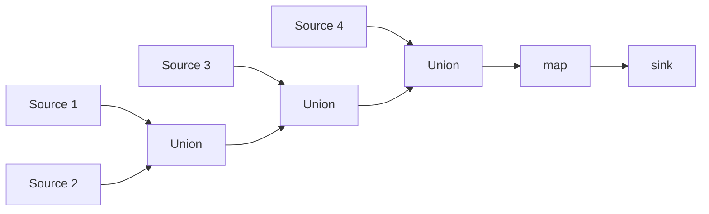
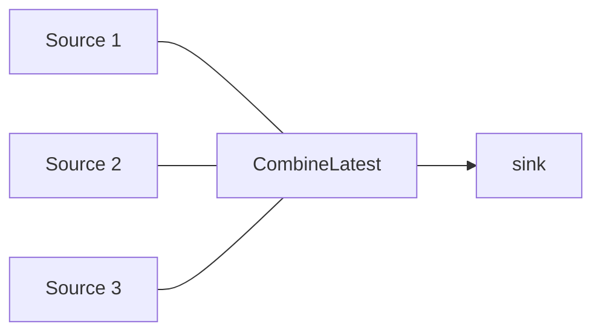
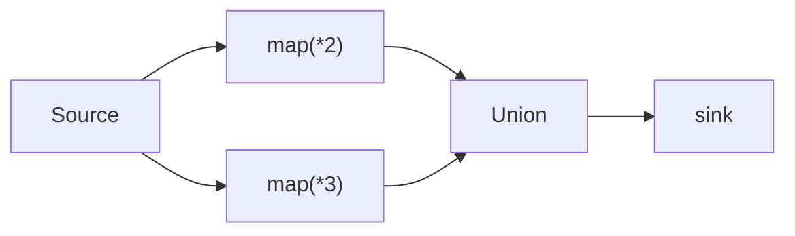
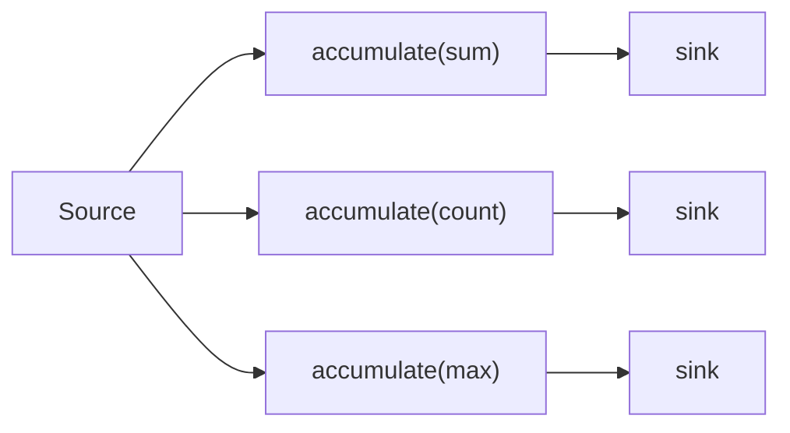
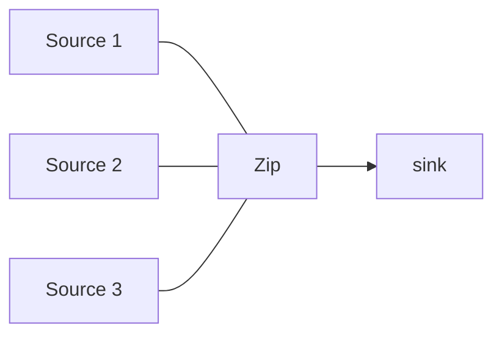
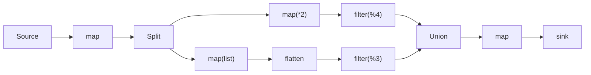
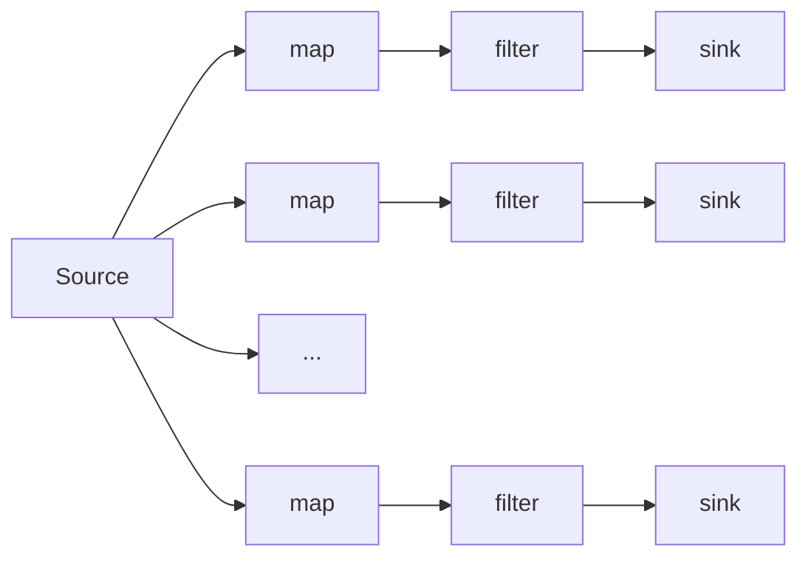

# Benchmarks

Benchmarks comparing `akayu` performance against the original `streamz` library and pure Python implementations.

**Environment:**

- Python 3.13.11
- Linux (x86_64)
- pytest-benchmark 5.2.3

## Summary

Performance improvements are consistent across various topology types, with `akayu` providing significant speedups over `streamz` due to its Rust-based execution engine.

| Topology Type | Scenario                              | Typical Speedup  |
| ------------- | ------------------------------------- | ---------------- |
| Deep Chains   | Long chains of operations (10+ nodes) | **~3.2x**        |
| Branching     | Fan-out, diamond patterns             | **~2.5x - 3.7x** |
| Merging       | Union, Zip, CombineLatest             | **~2.5x - 3.6x** |
| Complex DAG   | Split, flatten, union mixed           | **~3.9x**        |

**Key Takeaway:** `akayu` consistently outperforms `streamz` by optimizing graph traversal and operation execution in Rust, even for complex topologies with multiple branches and merges.

## Complex Flow Topologies (500k items)

Benchmarks for complex stream patterns with multiple branches, joins, and deep pipelines.

| Topology                                        | akayu<br/>(ms) | streamz<br/>(ms) | Speedup         |
| ----------------------------------------------- | -------------- | ---------------- | --------------- |
| [Multi-union (4 sources)](#multi-union)         | 2,126.10       | 7,595.01         | **3.6x faster** |
| [Combine latest (3 sources)](#combine-latest)   | 1,671.63       | 4,297.74         | **2.6x faster** |
| [Diamond (split → union)](#diamond)             | 2,597.40       | 9,731.22         | **3.7x faster** |
| [Accumulate (3 branches)](#accumulate-branches) | 2,553.14       | 8,948.80         | **3.5x faster** |
| [Zip (3 sources)](#zip)                         | 3,829.93       | 9,433.68         | **2.5x faster** |
| [Deep pipeline (10 maps)](#deep-pipeline)       | 5,845.66       | 18,724.42        | **3.2x faster** |
| [Complex DAG](#complex-dag)                     | 4,550.05       | 17,749.49        | **3.9x faster** |
| [Fan-out (5 branches)](#fan-out)                | 6,953.44       | 17,372.14        | **2.5x faster** |

## Throughput Comparison (500k items)

Comparison of raw throughput (items/sec). **`akayu` is the baseline (1x)**.

- **Pure Python** is faster (shown as multiplier, e.g., `37x`).
- **streamz** is slower (shown as fraction, e.g., `1/2.9x`).

| Topology            | akayu<br/>(items/sec) | Pure Python<br/>(items/sec) | streamz<br/>(items/sec) |
| ------------------- | --------------------: | --------------------------: | ----------------------: |
| **Simple Pipeline** |         247k (**1x**) |            9.05M (**~37x**) |        86k (**1/2.9x**) |
| **Diamond**         |         188k (**1x**) |            7.20M (**~38x**) |        51k (**1/3.7x**) |
| **Complex DAG**     |         110k (**1x**) |            2.30M (**~21x**) |        28k (**1/3.9x**) |
| **Fan-out**         |          72k (**1x**) |            1.95M (**~27x**) |        29k (**1/2.5x**) |
| **Deep Pipeline**   |          85k (**1x**) |            1.91M (**~22x**) |        26k (**1/3.3x**) |

**Observation:** `akayu` sits in the middle ground—significantly faster than `streamz` (typically 2.5x - 4x) while abstracting away the complexity that makes `Pure Python` faster but harder to maintain for complex flows.

**Observation:** The relative overhead **decreases** (improves) for heavier workloads. As the complexity of the Python work increases (e.g., Deep Pipeline, Complex DAG), `akayu`'s fixed per-item overhead becomes a smaller percentage of the total execution time compared to simpler topologies.

The overhead is primarily due to:

1. Stream graph traversal
1. Python function call overhead per operation
1. Dynamic dispatch for node types

For batch operations, `akayu` approaches pure Python generator performance while providing the reactive programming model.

## Running Benchmarks

/// tab | Nix (Recommended)

```bash
nix develop -c just bench
```

///

/// tab | Just

```bash
just bench
```

///

/// tab | Manual

```bash
maturin develop --release
pytest tests/test_benchmark.py tests/test_complex_benchmark.py tests/test_compile_benchmark.py -v --benchmark-only
```

///

## Benchmark Details

### Basic Pipeline

All benchmarks process 500,000 items through a pipeline of:

- `map(lambda x: x + 1)`
- `filter(lambda x: x % 2 == 0)`
- `sink(results.append)`


Timing includes pipeline setup and all item processing.

### Multi-union

4 separate sources merged via union chain.



### Combine latest

3 sources combined, emitting tuples of latest values.



### Diamond

Single source splits to 2 branches, then merges via union.



### Accumulate branches

Single source with 3 parallel accumulate operations (sum, count, max).



### Zip

3 sources zipped together element-by-element.



### Deep pipeline

10 chained map operations.


### Complex DAG

Split with one branch using flatten, then union.



### Fan-out

Single source with 5 parallel map→filter→sink branches.


