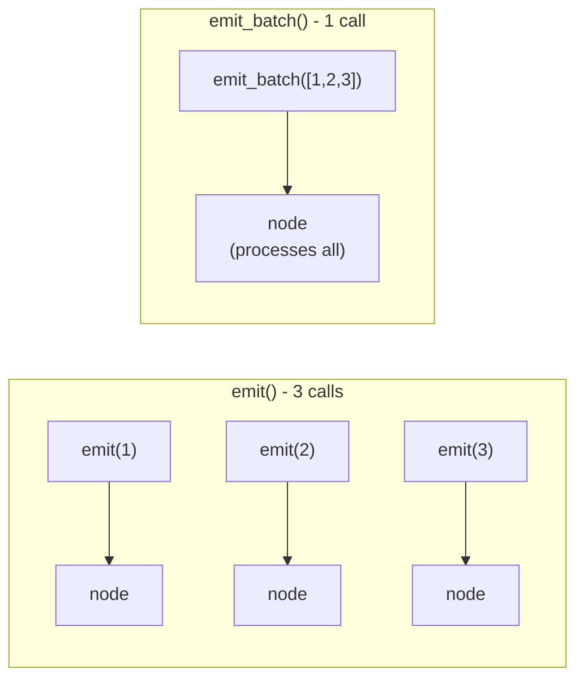
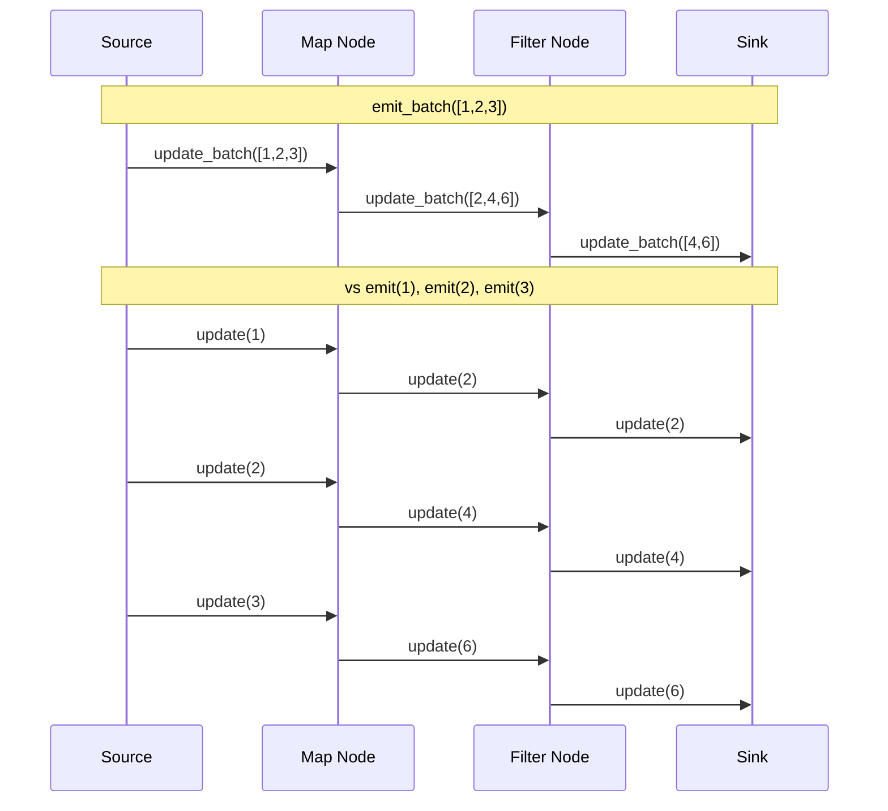
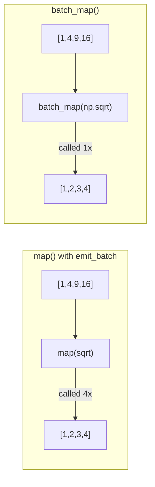
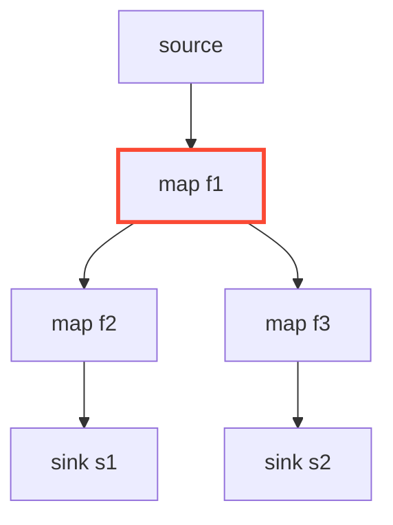
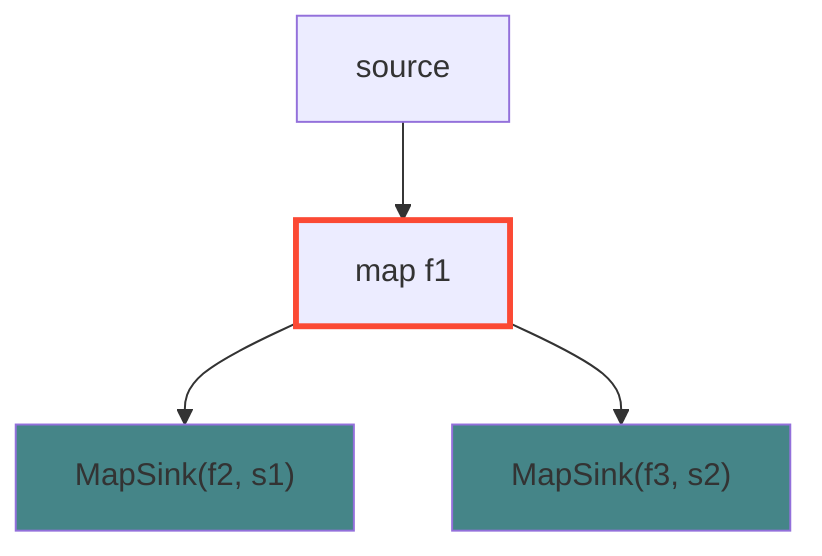
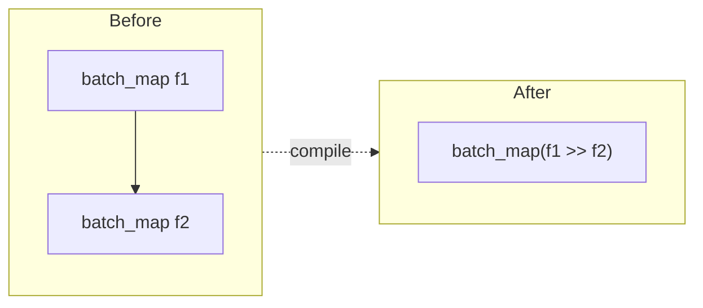
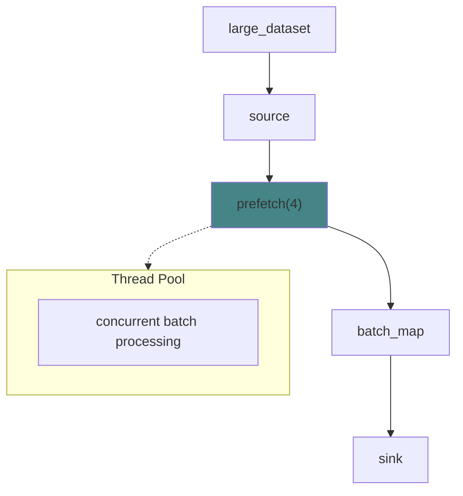
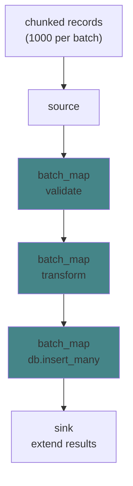
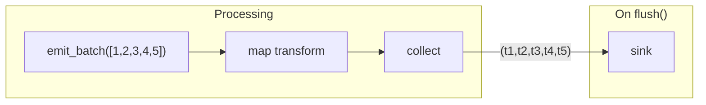

# Batch Processing

akayu provides efficient batch processing capabilities for high-throughput data pipelines. Understanding when to use `emit()` vs `emit_batch()` and how batch operations interact with optimizations can significantly improve performance.

## `emit()` vs `emit_batch()`

### `emit(x)` - Single Item

Pushes one item through the pipeline:

```python
source.emit(1)
source.emit(2)
source.emit(3)
```

Each call traverses the stream graph independently.

### `emit_batch(items)` - Multiple Items

Pushes multiple items through the pipeline together:

```python
source.emit_batch([1, 2, 3, 4, 5])
```



**Benefits of `emit_batch()`:**

- Reduced per-item overhead
- Better cache locality
- Enables vectorized operations with `batch_map()`
- More efficient for bulk data processing

**Benchmark comparison** (500k items):

| Method            | Time   |
| ----------------- | ------ |
| `emit()` per item | ~230ms |
| `emit_batch()`    | ~143ms |

## `update_batch()` Internal Mechanics

When you call `emit_batch()`, internally each node's `update_batch()` method is called instead of `update()`:



Each node type handles batches efficiently:

- **Map**: Applies function to each item, returns transformed batch
- **Filter**: Returns batch of items that pass predicate
- **Flatten**: Expands all iterables, returns flattened batch
- **BatchMap**: Calls function once with entire batch
- **Sink**: Calls function for each item (side effects)

## `batch_map()` - Vectorized Operations

Use `batch_map()` when your function can process multiple items at once:

```python
import numpy as np
import akayu

source = akayu.Stream()
results = []

# Function receives list, returns iterable
source.batch_map(np.sqrt).sink(results.append)
source.compile()

source.emit_batch([1, 4, 9, 16])
# Results: [1.0, 2.0, 3.0, 4.0]
```



### When to Use `batch_map()`

- NumPy/pandas operations on arrays
- Database batch queries
- API batch requests
- Any function optimized for bulk input

```python
def batch_db_lookup(ids):
    # Single query for all IDs
    return db.query("SELECT * FROM users WHERE id IN (?)", ids)

source.batch_map(batch_db_lookup).sink(process_user)
```

### `batch_map()` vs `map()` with `emit_batch()`

```python
# map() with emit_batch: function called N times
source.map(lambda x: x * 2)
source.emit_batch([1, 2, 3])  # lambda called 3 times

# batch_map(): function called once
source.batch_map(lambda batch: [x * 2 for x in batch])
source.emit_batch([1, 2, 3])  # lambda called 1 time with [1, 2, 3]
```

## Optimization Boundaries at Splits

Chain fusion (combining consecutive operations) **stops at split points** where a node has multiple downstreams:

```python
source = akayu.Stream()
branch = source.map(f1)

# Split: branch feeds two paths
branch.map(f2).sink(sink1)
branch.map(f3).sink(sink2)

source.compile()
```



**Why fusion stops at splits:**

- `f1` produces output consumed by both paths
- Can't fuse `f1` with `f2` because `f3` also needs `f1`'s output
- Each branch after the split is optimized independently

### After compile()



Each branch gets terminal fusion (green), but `f1` remains separate at the split point (red border).

### Working with Splits

If you need maximum fusion, consider restructuring:

```python
# Less optimal: split prevents f1 fusion
source.map(f1).map(f2).sink(s1)  # Can't fuse f1 if split exists elsewhere

# More optimal: duplicate the common operation
source.map(lambda x: f2(f1(x))).sink(s1)
source.map(lambda x: f3(f1(x))).sink(s2)
```

However, this trades fusion for duplicate computation. Choose based on whether:

- `f1` is expensive (keep shared)
- Function call overhead dominates (fuse)

## BatchMap Fusion

Consecutive `batch_map()` operations are fused:

```python
source.batch_map(f1).batch_map(f2)

# After compile: single batch_map(compose(f1, f2))
```



## Prefetch with Batch Operations

`prefetch()` works with `batch_map()` for concurrent vectorized processing:

```python
source.prefetch(4).batch_map(batch_process)
source.compile()

# Batches are processed concurrently
source.emit_batch(large_dataset)
```



## Example: Efficient Data Pipeline

```python
import akayu

def validate_batch(records):
    return [r for r in records if r.get("valid")]

def transform_batch(records):
    return [{"id": r["id"], "value": r["value"] * 2} for r in records]

def batch_insert(records):
    db.insert_many(records)
    return records  # Return for downstream

source = akayu.Stream()
inserted = []

(source
    .batch_map(validate_batch)
    .batch_map(transform_batch)
    .batch_map(batch_insert)
    .sink(lambda r: inserted.extend(r)))

source.compile()

# Process in batches for efficiency
for chunk in chunked(all_records, 1000):
    source.emit_batch(chunk)

source.flush()
```



After compile(), the three `batch_map` operations are fused into one!

## Collecting Results

Use `collect()` to buffer items and `flush()` to emit them as a batch:

```python
source = akayu.Stream()
collected = source.map(transform).collect()
results = []
collected.sink(results.append)

source.compile()

source.emit_batch([1, 2, 3, 4, 5])
source.flush()  # Emits (transformed_1, transformed_2, ...) as tuple

print(results)  # [(<all transformed items as tuple>)]
```



The `collect()` node buffers all items until `flush()` is called, then emits them as a single tuple.
