# Compile Optimizations

akayu includes a powerful optimization system that transforms your stream graph for maximum performance. Call `.compile()` on your source stream after building the pipeline to enable these optimizations.

## What `.compile()` Does

When you call `.compile()`, akayu:

1. **Freezes the topology** - Prevents further modifications to the stream graph
1. **Applies chain fusion** - Combines consecutive operations into single nodes
1. **Enables async check elimination** - Skips unnecessary awaitable checks for sync-only pipelines
1. **Marks convergence points** - Identifies nodes that need thread-safe locking for `par()` + `prefetch()` combinations

```python
source = akayu.Stream()
source.map(f1).map(f2).filter(p).sink(print)

# Apply optimizations
source.compile()

# Graph is now frozen - this would raise RuntimeError:
# source.map(another_func)
```

## Graph Locking & Immutability

It is critical to understand that `.compile()` transforms your dynamic graph into an **immutable, optimized execution engine**.

### The Locking Effect

When you call `.compile()` on a source stream:

- The entire reachable graph is traversed.
- Every node is marked as `compiled`.
- Any subsequent attempt to call a transformation method (like `.map()`, `.filter()`, `.sink()`, etc.) on *any* node in that graph will raise a `RuntimeError`.

### Example of Modifying a Compiled Graph

```python
source = akayu.Stream()
branch = source.map(lambda x: x + 1)

source.compile()

# This will raise RuntimeError: "Stream 'map' is already compiled"
new_node = branch.map(lambda x: x * 2) 
```



```mermaid
flowchart LR
    subgraph locked [Compiled & Locked Graph]
        direction LR
        S["Source 🔒"] --> M1["map 🔒"] --> S1["sink 🔒"]
    end

    M1 -.->|❌ RuntimeError| New[New Node]
    
    style locked stroke:#333,stroke-dasharray: 5 5
    style New stroke:#cc0000
```

This locking mechanism is necessary because many optimizations (like [Map Fusion](#map-fusion)) physically merge nodes and change the underlying propagation logic, making it impossible to safely attach new branches to the original structure.

## Map Fusion

Consecutive `map()` operations are fused into a single node with a composed function:

```mermaid
flowchart LR
    subgraph before [Before]
        A1[source] --> B1[map f1]
        B1 --> C1[map f2]
        C1 --> D1[map f3]
        D1 --> E1[sink]
    end
    subgraph after [After]
        A2["source 🔒"] --> B2["map(f1 >> f2 >> f3) 🔒"]
        B2 --> E2["sink 🔒"]
    end
    before -.-> after
```



This reduces:

- Node traversal overhead
- Python function call overhead
- Memory allocations for intermediate values

**Benchmark impact**: A pipeline with 10 chained maps shows ~34x speedup over streamz, partly due to fusion reducing 10 nodes to 1.

## Filter Fusion

Consecutive `filter()` operations are combined with short-circuit evaluation:

```mermaid
flowchart LR
    subgraph before [Before]
        A1[source] --> B1[filter p1]
        B1 --> C1[filter p2]
        C1 --> D1[sink]
    end
    subgraph after [After]
        A2["source 🔒"] --> B2["filter(p1 AND p2) 🔒"]
        B2 --> D2["sink 🔒"]
    end
    before -.-> after
```



The combined predicate uses short-circuit evaluation - if `p1` returns false, `p2` is never called.

## FilterMap Fusion

A `filter()` followed by `map()` is fused into a single `FilterMap` node:


This avoids the intermediate step of passing the value through the filter before mapping.

## Terminal Fusions

Operations ending in `sink()` are fused into specialized terminal nodes:

```mermaid
flowchart LR
    subgraph before [Before]
        A1[map func] --> B1[sink callback]
    end
    subgraph after [After]
        C1["MapSink 🔒"]
    end
    before -.-> after
```



| Pattern                   | Fused Node    | Behavior                        |
| ------------------------- | ------------- | ------------------------------- |
| `map` → `sink`            | MapSink       | `callback(func(x))`             |
| `filter` → `sink`         | FilterSink    | `if pred(x): callback(x)`       |
| `filter` → `map` → `sink` | FilterMapSink | `if pred(x): callback(func(x))` |

These terminal fusions eliminate propagation overhead since the combined node handles everything internally.

## Source Elimination

Intermediate `Source` nodes (like those created by `seq()`) that only forward values are bypassed:

```mermaid
flowchart LR
    subgraph before [Before]
        A1[any_node] --> B1[Source]
        B1 --> C1[downstream]
    end
    subgraph after [After]
        A2["any_node 🔒"] --> C2["downstream 🔒"]
    end
    before -.-> after
```



## Async Check Optimization

If all functions in the pipeline are synchronous, akayu can skip checking whether return values are awaitables:

```mermaid
flowchart LR
    subgraph before [Before: Per-Item Checks]
        N1[Map] --"result"--> C1{"is awaitable?"}
        C1 --"no"--> N2[Filter] --"result"--> C2{"is awaitable?"}
        C2 --"no"--> N3[Sink]
    end

    subgraph after [After: Checks Eliminated]
        M1["Map 🔒"] --"result"--> M2["Filter 🔒"] --"result"--> M3["Sink 🔒"]
    end

    before -.-> after
```



All nodes detected as sync → `skip_async_check = true` (no `isawaitable()` calls)

This optimization is only safe after compile because the topology is frozen.

## When to Use `.compile()`

**Use compile when:**

- Your pipeline topology is fixed before processing begins
- You're processing many items through the same pipeline
- Performance is critical

**Don't use compile when:**

- You need to dynamically add nodes during processing
- The pipeline is used once for a single item
- You're still debugging and iterating on the pipeline structure

## Example: Optimization in Action

```python
import akayu

source = akayu.Stream()
results = []

# Build a pipeline that will benefit from fusion
(source
    .filter(lambda x: x > 0)      # These three filters
    .filter(lambda x: x < 100)    # will be fused into one
    .filter(lambda x: x % 2 == 0)
    .map(lambda x: x * 2)         # These two maps
    .map(lambda x: x + 1)         # will be fused into one
    .sink(results.append))        # Terminal fusion with map

# Apply optimizations
source.compile()

# Process data through optimized pipeline
source.emit_batch(range(200))
```

**Before: 7 nodes**


**After: 2 nodes**

```mermaid
flowchart TD
    A["source 🔒"] --> B["FilterMapSink 🔒<br/>pred: combined<br/>func: *2, +1<br/>sink: append"]
```



## Checking Compilation Status

```python
source = akayu.Stream()
child = source.map(lambda x: x)

print(source.compiled)  # False

source.compile()

print(source.compiled)  # True
print(child.compiled)   # True (all reachable nodes are compiled)
```

## Limitations

Fusion stops at **split points** where a node has multiple downstreams:


The red-bordered node is a **split point** - it has multiple downstreams, so `f1` cannot be fused with `f2` or `f3`.

**After compile():**

```mermaid
flowchart TD
    A["source 🔒"] --> B["map f1 🔒"]
    B --> C["MapSink(f2, s1) 🔒"]
    B --> D["MapSink(f3, s2) 🔒"]

    style B stroke:#fb4934,stroke-width:3px
    style C fill:#458588
    style D fill:#458588
```



Each branch after the split is optimized independently (green nodes are fused), but `f1` stays separate.

```python
source = akayu.Stream()
branch = source.map(f1)

# Split: branch has two downstreams
branch.map(f2).sink(sink1)
branch.map(f3).sink(sink2)

source.compile()
# f1 cannot be fused with f2 or f3 because branch feeds both paths
```
