# Concurrency

akayu provides two mechanisms for concurrent processing that work efficiently together: `par()` for parallel branch execution and `prefetch()` for ordered concurrent processing within a single branch.

## `par()` - Parallel Branch Execution

The `par()` method creates a branch point where all downstream branches execute concurrently in a shared thread pool:

```python
source = akayu.Stream()
p = source.par()

# These branches run in parallel
a = p.map(load_from_disk)
b = p.map(fetch_from_api)

# Merge results
merged = akayu.union(a, b)

source.emit(filename)  # a and b execute concurrently
```

### How `par()` Works


When a value reaches a `par()` node:

1. The value is submitted to all downstream branches
1. Each branch executes in a worker thread from the shared pool (scales to CPU count)
1. Results flow to convergence points (like `union`) as they complete

**Timing comparison:**

| Mode       | Branch A | Branch B | Branch C | Total    |
| ---------- | -------- | -------- | -------- | -------- |
| Sequential | 0-10ms   | 10-20ms  | 20-30ms  | **30ms** |
| Parallel   | 0-10ms   | 0-10ms   | 0-10ms   | **10ms** |

### Use Cases for `par()`

- **I/O-bound operations**: When branches wait on disk, network, or database
- **Independent processing**: When branches don't depend on each other's results
- **Fan-out patterns**: Processing the same input multiple ways

```python
source = akayu.Stream()
p = source.par()

# Fan-out: same data processed three ways
p.map(save_to_database).sink(log_db_result)
p.map(send_notification).sink(log_notification)
p.map(update_cache).sink(log_cache_update)

source.compile()
```


### Returning to Sequential

Use `seq()` after merging parallel branches to explicitly mark sequential execution:

```python
merged = akayu.union(a, b).seq()
merged.map(sequential_op).sink(print)
```

## `prefetch()` - Ordered Concurrent Processing

The `prefetch(n)` method processes up to `n` items concurrently while **preserving output order**:

```python
source = akayu.Stream()
source.prefetch(4).map(slow_operation).sink(results.append)
source.compile()

# Items processed concurrently but results arrive in order
source.emit_batch([1, 2, 3, 4, 5, 6, 7, 8])
```

### How `prefetch()` Works


1. Each incoming item gets a sequence number
1. Up to `n` items are submitted to the thread pool simultaneously
1. Results are buffered and released in sequence number order
1. Backpressure: when `n` items are in flight, new items wait

**Order preservation:**

```mermaid
sequenceDiagram
    participant In as Input
    participant Pool as Thread Pool
    participant Buf as Reorder Buffer
    participant Out as Output

    In->>Pool: item 1 (seq#0)
    In->>Pool: item 2 (seq#1)
    In->>Pool: item 3 (seq#2)
    Pool->>Buf: result 2 (seq#1)
    Pool->>Buf: result 1 (seq#0)
    Buf->>Out: result 1 ✓
    Buf->>Out: result 2 ✓
    Pool->>Buf: result 3 (seq#2)
    Buf->>Out: result 3 ✓
```



Even if item 2 finishes before item 1, it waits in the buffer until item 1 is emitted.

### Prefetch with Different Operations

`prefetch()` automatically fuses with the following operation:

```python
# Prefetch + map = PrefetchMap
source.prefetch(4).map(func)

# Prefetch + filter = PrefetchFilter
source.prefetch(4).filter(pred)

# Prefetch + batch_map = PrefetchBatchMap
source.prefetch(4).batch_map(vectorized_func)
```


### When to Use `prefetch()`

- **Slow per-item operations**: API calls, file I/O, image processing
- **Order-sensitive pipelines**: When downstream logic depends on item order
- **Rate-limited resources**: Control concurrency with the capacity parameter

```python
# Process 4 images concurrently, results in original order
source.prefetch(4).map(process_image).sink(save_result)
```

## Combining `par()` and `prefetch()`

`par()` and `prefetch()` share the same thread pool (scales to CPU count), so combining them has minimal overhead:

```python
source = akayu.Stream()
p = source.par()

# Branch 1: prefetch for ordered concurrent I/O
a = p.prefetch(4).map(fetch_from_api_a)

# Branch 2: prefetch for ordered concurrent I/O
b = p.prefetch(4).map(fetch_from_api_b)

merged = akayu.union(a, b)
source.compile()
```


### Thread Safety at Convergence Points

When `prefetch()` is used inside `par()` branches, akayu automatically applies locking at convergence points (like `union`) to prevent race conditions:

```mermaid
flowchart TD
    S[source]:::source --> P[par]:::process
    P --> A["prefetch + map"]:::process
    P --> B["prefetch + map"]:::process
    A --> U["union 🔒"]:::warn
    B --> U
    U --> K[sink]:::sink

    style U stroke:#d97706,stroke-width:3px
```



The lock (🔒) ensures thread-safe updates when multiple prefetch workers emit simultaneously.

```python
p = source.par()
a = p.prefetch(4).map(f1)  # Internal threading
b = p.prefetch(4).map(f2)  # Internal threading
merged = akayu.union(a, b)  # Lock applied here
```

The locking is optimized:

- Only convergence points (nodes reachable from multiple branches) are locked
- Individual branch nodes don't need locks since they're not shared
- Detected automatically during `compile()`

### Performance Characteristics

| Configuration           | Behavior                                        |
| ----------------------- | ----------------------------------------------- |
| `prefetch(n)` alone     | n concurrent items, ordered output              |
| `par()` alone           | Branches run in parallel                        |
| `par()` + `prefetch(n)` | Parallel branches, each with n concurrent items |

Benchmark showing minimal overhead when combining:

| Configuration           | Time (50 items, 10ms I/O each) |
| ----------------------- | ------------------------------ |
| `prefetch(4)` alone     | ~135ms                         |
| `par()` + `prefetch(4)` | ~136ms                         |

## Flush for Prefetch

When using `prefetch()`, call `flush()` to wait for all in-flight items to complete:

```python
source = akayu.Stream()
source.prefetch(4).map(slow_op).sink(results.append)
source.compile()

source.emit_batch(items)
source.flush()  # Wait for all items to complete

print(results)  # All results now available
```


## Example: Parallel API Fetching

```python
import akayu

def fetch_user(user_id):
    # Simulated API call
    return {"id": user_id, "name": f"User {user_id}"}

def fetch_orders(user_id):
    # Simulated API call
    return {"user_id": user_id, "orders": []}

source = akayu.Stream()
p = source.par()

users = []
orders = []

# Fetch users and orders in parallel
p.prefetch(4).map(fetch_user).sink(users.append)
p.prefetch(4).map(fetch_orders).sink(orders.append)

source.compile()

# Process user IDs
source.emit_batch([1, 2, 3, 4, 5])
source.flush()

# Both users and orders fetched concurrently
print(f"Users: {len(users)}, Orders: {len(orders)}")
```


Both API endpoints are called concurrently for each user ID, with 4 concurrent requests per branch = up to 8 total concurrent I/O operations.
