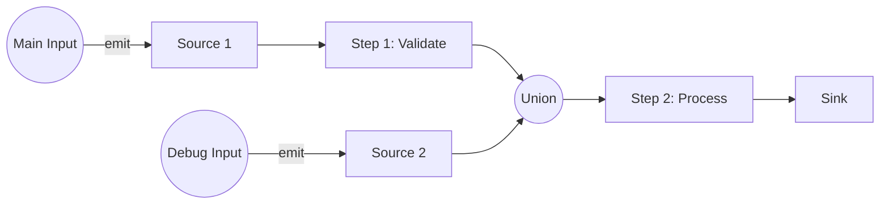
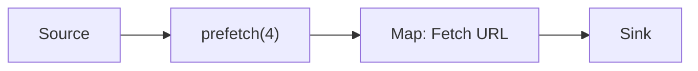
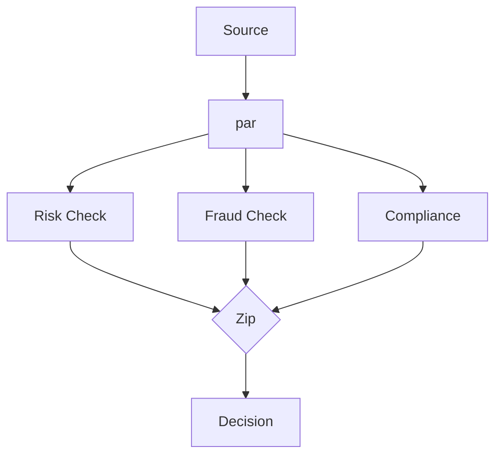
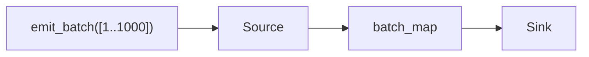

# Patterns & Best Practices

This guide covers common architectural patterns for building robust pipelines with `akayu`.

## Injecting Data Midway (The "Side-Door" Pattern)

A common requirement is to inject data into the middle of a pipeline—either for testing specific components in isolation or for merging control signals. Since `akayu` restricts `emit()` to source nodes only, you cannot simply call `emit()` on an intermediate node.

**The Solution**: Use `union()` to attach a secondary "injection" Source node at the desired point.



### Example Code

```python
import akayu

main_source = akayu.Stream(name="main")
debug_source = akayu.Stream(name="debug")

# Standard pipeline flow
pipeline = main_source.map(validate_data)

# Merge debug source before the expensive processing step
# Both valid main data AND debug data will flow into process_data
processing = pipeline.union(debug_source).map(process_data).sink(print)

main_source.compile()

# Normal operation
main_source.emit(user_data)

# Test/Debug operation (skips validation)
debug_source.emit(test_vector)
```

## Concurrency Strategies

Choosing between `par()` and `prefetch()` depends on your bottleneck.

### Strategy A: The I/O Scaler (`prefetch`)

Use `prefetch()` when your pipeline is bound by latency (waiting for external resources) rather than CPU work.

*   **Best For**: API calls, Database queries, File downloads.
*   **Pros**: Simple syntax, strictly preserves order, controls concurrency limit.



```python
source = akayu.Stream()
# Keep 4 requests in flight at once
source.prefetch(4).map(requests.get).sink(save_response)
```

### Strategy B: The Scatter-Gather (Diamond Pattern)

Use `par()` combined with `zip()` or `union()` when you need to perform multiple independent analyses on the same data item.

*   **Best For**: Multi-model inference, enriching data from multiple sources.



```python
source = akayu.Stream()
p = source.par()

# Independent checks running in parallel
risk = p.map(check_risk)
fraud = p.map(check_fraud)
compliance = p.map(check_compliance)

# Wait for all 3 to finish, then combine results
akayu.zip(risk, fraud, compliance).map(make_decision).sink(print)
```

## Batch Processing Integration

When working with data science libraries like NumPy or Pandas, processing item-by-item kills performance.

**The Pattern**: Always pair `emit_batch()` at the source with `batch_map()` in the pipeline. This ensures the data stays in efficient vector formats (like Lists or Arrays) throughout the pipeline.



```python
import numpy as np

source = akayu.Stream()

# Function receives the whole list/array, not one item
def vector_op(batch):
    arr = np.array(batch)
    return arr * 2  # Vectorized multiplication

source.batch_map(vector_op).sink(store_results)

# Efficiently push chunks of data
source.emit_batch(large_data_chunk)
```

## Anti-Patterns

### 1. The "Late Modification"

Attempting to modify the graph after `compile()` will crash your application.

```python
s = akayu.Stream()
s.map(f1)
s.compile()

s.map(f2)  # ❌ RuntimeError: Graph is locked
```

**Fix**: Define the entire topology before calling compile.

### 2. The Trivial Parallelism

Using `par()` for cheap operations (like simple arithmetic) often makes code *slower* due to thread switching overhead.

```python
# ❌ Anti-Pattern: Parallelizing trivial math
s.par().map(lambda x: x + 1) 
```

**Fix**: Only parallelize tasks that take >1ms (I/O, heavy compute). For simple math, standard sequential processing is faster.
